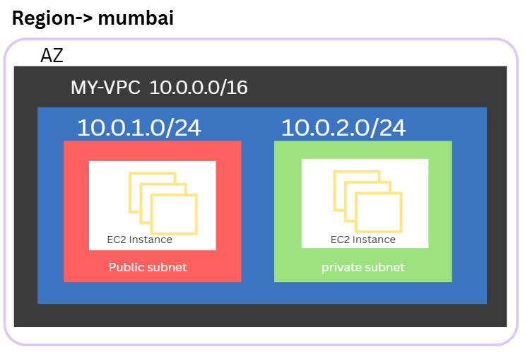

# Cloude Networing :

cloude networking is is a set of netwoking services that are used to create and manage the network in the cloud on-demand through a public , private or hybrid plaform.

## core competencies:

1.  vpc
2.  cid and ip addressing
3.  subnets
4.  security groups
5.  route tables
6.  internet gateway
7.  nat gateway
8.  load balancer
9.  vpn gateway
10. direct connect

## Advantages of Cloud Networking:

1. flexibility : flexibility to scale the network up or down as needed.

2. availability : high availability and fault tolerance.

3. security : enhanced security and compliance.

4. cost-effectiveness : cost-effective solution.

5. scalability : easily scalable to meet business needs.

6. automation : automated provisioning and management.

7. monitoring : real-time monitoring and analytics.

8. management : simplified network management.

## Importance Concept:

1. Region
2. Availability Zone
3. Subnet
4. Route Table
5. Internet Gateway
6. NAT Gateway
7. Security Group
8. Network ACL

### 1. Region

Region is a physical location where the data center is located.

### 2. Availability Zone

Availability Zone is a collection of data centers.

### 3. Subnet

Subnet is a range of IP addresses that are used to create a network.

### 4. Route Table

Route Table is a set of rules that are used to route traffic between subnets.

### 5. Internet Gateway

Internet Gateway is a service that allows instances in a VPC to connect to the internet.

### 6. NAT Gateway

NAT Gateway is a service that allows instances in a VPC to connect to the internet.

### 7. Security Group

Security Group is a set of rules that are used to control the traffic that is allowed to enter or leave a VPC.

### 8. Network ACL

Network ACL is a set of rules that are used to control the traffic that is allowed to enter or leave a VPC.

## conceptual diagram:

world divided -> us, asia , europe
|
|** region -> asia(singapur,mumbai,sydney,jakarta,hongkong,tokyo)
| |
| |** availability zone -> pick mumbai(ap-south-1) -> availability zone 1,2,3
| | |** vpc -> 10.0.0.0/16
| | | |** subnet -> 10.0.0.0/24 (public subnet)
| | | | |** route table
| | | | |** public subnet
| | | | |** private subnet
| | | | |** nat gateway
| | | | |** security group
| | | | |** network acl

```

# key point to remember for terraform vpc

VPC
 ↓
Subnets
 ↓
Route Tables
 ↓
Internet Gateway / NAT Gateway
 ↓
Network connectivity

```

# AWS: Region -> Availability Zone -> VPC -> Subnet -> Route Table -> Public Subnet -> Private Subnet -> NAT Gateway -> Security Group -> Network ACL

We move into Aws networking, one of the most important topic in cloud computing for desing and deploy the applications using terraform.

1. VPC (Virtual Private Cloud)
2. CIDR (Classless Inter-Domain Routing)
3. Subnet (Public and Private)
4. Routing Table
5. Internet Gateway
6. NAT Gateway
7. Security Group
8. Network ACL
9. Elastic IP
10. Route 53

https://docs.aws.amazon.com/vpc/latest/userguide/aws-vpc-design-reference.html

## diagram

```
   www.google.com
          |
       Route 53 -> DNS Resolve
          |
       Internet -> physical server or network of servers connected to the globe
          |
    Internet Gateway -> AWS manage the IGW and provide the connection to the internet in AWS managed way for compute load or heavy traffic
          |
        VPC -> logical isolation of private network inside the region (cidr block)
      /    \
     /      \
  subnet-A    subnet-B
 (public)     (private)
   / \         / \
  /   \       /   \
 /     \     /     \
EC2    RDS   EC2   RDS
 |      |     |      |
 |      |     |      |
Security Group |      | Security Group
 |      |     |      |
Network ACL    |    Network ACL
              |
            Route Table
```

## VPC (Virtual Private Cloud)

vpc is a private network in aws cloud where we can deploy the resources.
vpc is isolated from other vpcs in the aws cloud.
vpc is a regional resource, it is not a global resource.
vpc is a virtual network that is created by aws and provided to the users.
vpc is a virtual network that is created by users and provided to the aws.

https://docs.aws.amazon.com/vpc/latest/userguide/what-is-vpc.html

```
AWS
└── VPC
    ├── Public Subnet
    ├── Private Subnet
    ├── Route Table
    └── Internet Gateway

```

**VPC Architecture:**

```
                    Internet
                       │
                       ▼
                Internet Gateway
                       │
              ┌────────┴────────┐
              │                 │
        Public Subnet      Public Subnet
        AZ: 1a              AZ: 1b
              │                 │
          NAT Gateway       NAT Gateway
              │                 │
              ▼                 ▼
        Private Subnet     Private Subnet
        AZ: 1a              AZ: 1b
              │                 │
            EC2/EKS          EC2/EKS
              │                 │
              └────────┬────────┘
                       │
                    Database
```

When we create a vpc we need to provide the cidr block that define the IP address range for entire vpc. for example .

vpc cidr block - 10.0.0.0/16

```bash
resource "aws_vpc" "main" {
  cidr_block           = "10.0.0.0/16"
  enable_dns_hostnames = true
  enable_dns_support   = true

  tags = {
    Name = "my-vpc"
  }
}

```

## CIDR (Classless Inter-Domain Routing)

CIDR is a method for allowing ip addresses and routing ip packets inside the networks.

cidr is a range of IP addresses that are used to create a network or range of a network inside vpc.

**cidr example:**

```
10.0.0.0/16
│        │
│        └── 16 network bits
└─────────── Network address
```

link https://cidr.xyz/

https://docs.aws.amazon.com/vpc/latest/userguide/VPC_CIDR.html

## Subnet

A subnet is a smaller segmented part of a larger network(vpc) that is used to isolate resources and organizes devices/resources within a specific IP address range for Security, Control, and Compliance.

A subnet is a range of IP addresses that are used to create a network or range of a network inside vpc.

https://docs.aws.amazon.com/vpc/latest/userguide/VPC_Subnets.html

```
VPC
10.0.0.0/16
│
├── Public-A
│   10.0.1.0/24
│
├── Public-B
│   10.0.2.0/24
│
├── Private-A
│   10.0.11.0/24
│
└── Private-B
    10.0.12.0/24

```

```bash
# create public subnet at az1a
resource "aws_subnet" "public_a" {
  vpc_id            = aws_vpc.main.id
  cidr_block        = "10.0.1.0/24"
  availability_zone = "ap-south-1a"

  tags = {
    Name = "public-a"
  }
}

# create public subnet at az1b
resource "aws_subnet" "public_b" {
  vpc_id            = aws_vpc.main.id
  cidr_block        = "10.0.2.0/24"
  availability_zone = "ap-south-1b"

  tags = {
    Name = "public-b"
  }
}

# create private subnet at az1a
resource "aws_subnet" "private_a" {
  vpc_id            = aws_vpc.main.id
  cidr_block        = "10.0.3.0/24"
  availability_zone = "ap-south-1a"

  tags = {
    Name = "private-a"
  }
}

# create private subnet at az1b
resource "aws_subnet" "private_b" {
  vpc_id            = aws_vpc.main.id
  cidr_block        = "10.0.4.0/24"
  availability_zone = "ap-south-1b"

  tags = {
    Name = "private-b"
  }
}
```

### Public Subnet

Public subnet is a subnet that is connected to the internet gateway. access to internet (inbound and outbound).

```bash
resource "aws_subnet" "public" {
  vpc_id     = aws_vpc.main.id
  cidr_block = "10.0.1.0/24"
}
```

### Private Subnet

Private subnet is a subnet that is not connected to the internet gateway. access to internet (outbound only).

```
AWS
└── VPC
    ├── Public Subnet (Connected to Internet Gateway)
    │   └── Resources: Web Servers, Load Balancers
    │
    └── Private Subnet (No direct Internet access)
        └── Resources: Databases, Application Servers
```

Example:

```
VPC -> large network that can hold multiple subnets (range of ip address)
10.0.0.0/16 -> (large network or range of IP addresses)
│
├── Public Subnet (range of ip address)
│   10.0.1.0/24
│
└── Private Subnet (range of ip address)
    10.0.2.0/24

```



```bash
# Private subnet example (private subnet do not have access to internet gateway)
resource "aws_subnet" "private" {
  vpc_id            = aws_vpc.main.id
  cidr_block        = "10.0.11.0/24"
  availability_zone = "ap-south-1a"

  tags = {
    Name = "private-subnet"
  }
}
```

**_if its routes to internet directly it is public subnet otherwise private subnet_**

**_If its route table only contains:_**

```
10.0.0.0/16 - local
```

then the subnet is **Private Subnet**

**_there is no direct Internet route in private subnet_**

**_Example of private subnet route table:_**

```
Destination        Target
--------------------------------
10.0.0.0/16        local
```

**_If route have igw then it is public subnet_**

## Route Table

A route table is a set of rules that are used to route traffic between subnets.

used to determine where network traffic from our subnet or gateways is directed . Each subnet in our vpc must be associated with a route table, which controls routeing rules for that subnet.

```bash
#For Example
Destination        Target
--------------------------------
10.0.0.0/16        local
0.0.0.0/0          Internet Gateway

# Meaning
10.0.0.0/16
    ↓
Stay inside VPC

0.0.0.0/0 # extremely important to remember this for interviews
    ↓
Send toward Internet Gateway
```

https://docs.aws.amazon.com/vpc/latest/userguide/VPC_RouteTables.html

For Public Subnet: For private Subnet:

```
internet                           internet
   |                                  |
   | Inbound & Outbound               IGW -> Outbound Only
   |                                  |
 internet gateway (IGW)             Public subnet
   |                                  |
   |Route Table                      NAT Gateway (NAT-GW)
   |                                   |
   |                                   |Route Table
 public subnet                       Private subnet
    |                                   |
    EC2 instance (web server)          EC2 Instance (RDS)
    load balancer (NLB,ALB)
```

```bash
resource "aws_route_table" "public" {
  vpc_id = aws_vpc.main.id

  route {
    cidr_block = "0.0.0.0/0"
    gateway_id = aws_internet_gateway.main.id
  }

  tags = {
    Name = "public-route-table"
  }
}
```

### Associate Route Table

An association is a connection between a route table and a subnet. It tells the subnet which route table to use for routing traffic.

we need to associate route table to subnet (in terraform)

```
VPC
│
├── Internet Gateway
│
├── Route Table
│      │
│      └── 0.0.0.0/0 → IGW
│
└── Public Subnet
       │
       └── Route Table Association
```

```bash

#For Public Subnet
resource "aws_route_table_association" "public" {
  subnet_id      = aws_subnet.public.id
  route_table_id = aws_route_table.public.id
}

#For Private Subnet
resource "aws_route_table_association" "private" {
  subnet_id      = aws_subnet.private.id
  route_table_id = aws_route_table.private.id
}
```

## Internet Gateway

Internet Gateway (IGW) is a horizontally scaled, redundant, and highly available VPC component that allows communication between resources in our VPC and the internet. It is a regional resource that can be attached to only one VPC at a time, but you can attach up to five IGWs to a VPC. It enables inbound and outbound internet access for resources in our VPC that are in public subnets.

```
VPC
 │
 └── Internet Gateway
```

An internet Gateway is a component of aws that is used to connect between instance in our vpc to the internet . we use it in public subnet only

```bash
resource "aws_internet_gateway" "main" {
  vpc_id = aws_vpc.main.id

  tags = {
    Name = "main-igw"
  }
}
```

https://docs.aws.amazon.com/vpc/latest/userguide/vpc-igw-igw.html

```
                                 Internet
                                   │
                     ┌───────────────┴───────────────┐
                     │                               │
         ┌───────────▼────────────┐      ┌───────────▼────────────┐
         │                        │      │                        │
     [Public Subnet]──────────────┤      ├────────[Private Subnet]
         │                        │      │                        │
         │ Inbound/Outbound       │      │ Outbound Only          │
         │                        │      │                        │
         ▼                        ▼      ▼                        ▼
     ┌────────────┐         ┌─────────┐         ┌────────────┐
     │  Internet  │         │  NAT    │         │    DB      │
     │  Gateway   │         │  Gateway│         │ Instance   │
     └────────────┘         └─────────┘         └────────────┘
```

## NAT Gateway

NAT(Network Address Translation) gateway is a fully managed AWS service that enables instances in a private subnet to connect to the internet or other AWS services, but prevents the internet from initiating a connection with those instances.

NAT Gateway is a resource that is used to provide internet access to instances in a private subnet.

NAT Gateway is a resource that is deployed in the public subnet.

NAT Gateway is a regional resource that can be attached to only one VPC at a time, but you can attach up to five NAT Gateways to a VPC.

NAT Gateway is a resource that can be deployed in the public subnet.

### KEY POINTS

- NAT Gateway is deployed in the public subnet.
- Route table of private subnet is associated with NAT Gateway.
- NAT Gateway is used to provide internet access to instances in a private subnet.

https://docs.aws.amazon.com/vpc/latest/userguide/nat-gateway.html

```
AWS


Internet Gateway
    │
    │ Outbound traffic only (initiated from inside the VPC)
    ▼
Public Subnet → Route Table → NAT Gateway → Internet Gateway → Internet
    │                                                              │
    └────────── ───────────> Private Subnet ───────────────────────┘

```

## Security Groups

Network security groups act as virtual firewalls rules for our resources such as (EC2 instances, RDS databases, etc.) to control inbound and outbound traffic.

Security groups allow or deny traffic at the instance level. They are stateful, meaning if traffic is allowed in one direction, it is automatically allowed in the return direction.

Rules that we define in a security group are applied to all instances that are associated with that security group.

SG can be instance specific or subnet specific not only instance and it can be attached to as many instances as we want.

https://docs.aws.amazon.com/AWSEC2/latest/UserGuide/security-group-concepts.html

Example :

```
Security Group (EG1)
  ├─ Inbound Rules:
  │   ├─ Allow SSH (TCP port 22) from anywhere (0.0.0.0/0) - For administrators
  │   └─ Allow HTTP (TCP port 80) from anywhere (0.0.0.0/0) - For website access
  │
  └─ Outbound Rules:
      └─ Allow all outbound traffic (0.0.0.0/0) - For server updates and external API calls

Instance (Web Server)
  └─ Associated Security Group: EG1
```

Result: This web server can receive SSH and HTTP traffic from the internet and can connect to external resources, while all other traffic is blocked by default.

## Network ACL (Network Access Control List)

Network ACLs (NACLs) are optional security layers that act as firewalls for controlling traffic at the **subnet** level. They are stateless, meaning rules must be defined for both inbound and outbound traffic explicitly.

Allow or deny rule only.

https://repost.aws/knowledge-center/network-acl-subnet-traffic

### Key Characteristics

- **Subnet Level:** NACLs are associated with entire subnets, not individual instances.
- **Stateless:** If you allow inbound traffic, you must explicitly allow the corresponding outbound return traffic (and vice versa).
- **Evaluates All Rules:** Unlike Security Groups, NACLs evaluate all rules in order before allowing or denying traffic.
- **Default NACL:** Automatically created with a VPC, allowing all inbound and outbound traffic.

### Example NACL Configuration

```
Network ACL (ACL-001)
  ├─ Inbound Rules:
  │   ├─ Rule 100: Allow SSH (TCP port 22) from source [IP Range]
  │   ├─ Rule 200: Allow HTTP (TCP port 80) from source [IP Range]
  │   └─ Rule 300: Allow HTTPS (TCP port 443) from source [IP Range]
  │
  └─ Outbound Rules:
      ├─ Rule 100: Allow SSH Reply (TCP ports 1024-65535) to source [IP Range]
      ├─ Rule 200: Allow HTTP Reply (TCP ports 1024-65535) to source [IP Range]
      └─ Rule 300: Allow HTTPS Reply (TCP ports 1024-65535) to source [IP Range]

Subnet
  └─ Associated Network ACL: ACL-001
```

### Analogy

- **Security Group:** Like a **bouncer at a club door** (Instance level). Checks IDs for each person entering.
- **Network ACL:** Like a **security checkpoint at the entrance to the entire building** (Subnet level). Checks everyone entering and leaving.

### Common Use Cases

- **Isolating Subnets:** Blocking specific IP ranges from entering or leaving a subnet.
- **Compliance Requirements:** Enforcing strict inbound/outbound rules for sensitive data.
- **Default Deny:** Creating a "deny-all" rule at the end of the NACL to block any traffic not explicitly allowed.

## VPC Peering

VPC peering is a networking connection between two VPCs that enables we to route traffic between them privately using private IP address . It is a fully managed AWS service that is available in all AWS regions.

https://docs.aws.amazon.com/vpc/latest/userguide/vpc-peering.html

### key feature:

- it use private ip address to route traffic between two vpcs .
- it is a fully managed aws service that is available in all aws regions .
- it is a regional service, it is not a global resource.
- it is a virtual network that is created by aws and provided to the users.
- it is a virtual network that is created by users and provided to the aws.

## VPC Endpoints

VPC endpoints allow we to connect our VPC to supported AWS services and VPC endpoint services powered by AWS PrivateLink without requiring an internet gateway, NAT device, or NAT instance.

Allow we to privately connect our VPC to supported AWS services and vpc endpoint services powered by AWS privateLink.

https://docs.aws.amazon.com/vpc/latest/userguide/vpc-endpoints.html

### types of VPC Endpoints

1. Interface endpoint
2. Gateway endpoint

## Bastion Host

Bastion host is a special kind of host that is used to connect to instances in a private subnet.

In other word we can say that bastion host is a jump box.

Bastion host is an EC2 instance that is deployed in the public subnet and used to connect to instances in the private subnet.

https://docs.aws.amazon.com/quickstart/latest/linux-bastion/overview.html

### Example Bastion Host Configuration

```
VPC (10.0.0.0/16)
  ├─ Public Subnet (10.0.1.0/24)
  │   └─ EC2 Instance (Bastion Host) - Public IP for SSH access
  │
  └─ Private Subnet (10.0.2.0/24)
      └─ EC2 Instance (Web Server) - No public IP
```

### Key Benefits

1. **Enhanced Security:**
   - **Single Entry Point:** All SSH access goes through the bastion host, reducing the attack surface.
   - **Restricted Access:** Private instances never get a public IP, making them unreachable directly from the internet.
   - **Centralized Logging:** All administrative access can be monitored and logged in one place.

2. **Compliance & Audit:**
   - **Access Control:** Use Security Groups to allow SSH access _only_ to the bastion host.
   - **Auditing:** Easily track who accessed the bastion and when.
   - **Principle of Least Privilege:** Only bastion admins need SSH access, not every developer.

3. **Network Architecture:**
   - **Simplified Security Groups:** Define rules once on the bastion, then route traffic through it.
   - **Jump Box:** Allows administrators to "jump" from the public bastion to private instances.

### Common Security Group Rules for Bastion Host

```
Bastion Security Group
  ├─ Inbound Rules:
  │   ├─ Allow SSH (TCP port 22) from [Your Admin IP] - For administrators
  │   └─ Allow SSH (TCP port 22) from [Bastion IP] - For connecting to private instances (optional, depends on config)
  │
  └─ Outbound Rules:
      └─ Allow All (0.0.0.0/0) - For SSH access to private instances

```

## Elastic IP Address

Elastic IP address is a static public IP address that can be associated with an EC2 instance. It is a virtual IP address that can be moved from one EC2 instance to another EC2 instance.

### why we need it

we need it because when the ec2 instance is terminated or replaced by new instance the ip address is also changed. so we need a static public IP address that can be associated with an EC2 instance. It is a virtual IP address that can be moved from one EC2 instance to another EC2 instance.

https://docs.aws.amazon.com/AWSEC2/latest/UserGuide/elastic-ip-addresses.html

### Example Elastic IP Configuration

```
EC2 Instance (Web Server) - No public IP
  └─ Elastic IP - Public IP for website access
```

### key characteristic of elastic IP address

- it is a static public IP address that can be associated with an EC2 instance.
- it is a virtual IP address that can be moved from one EC2 instance to another EC2 instance.
- it is a regional resource.
- it is a managed by AWS service.

## Route 53

Route 53 is a managed DNS service that allows we to connect our VPC to the AWS network.

### types of Route 53

1. DNS Routing
2. Health Checking
3. Domain Registration
4. DNSSEC

### key features of Route 53

- it is a managed DNS service that allows we to connect our VPC to the AWS network.
- it is a regional resource.
- it is a managed by AWS service.
- it is a high availability service.

https://docs.aws.amazon.com/route53/latest/developerguide/what-is-route-53.html

## VPC GATEWAY

VPC Gateway is a virtual network gateway that allows we to connect our VPC to the AWS network.

https://docs.aws.amazon.com/vpc/latest/userguide/vpc-gateways.html

## VPC Flow Logs

Capture information about IP traffic going to and from network interfaces in your VPC.

https://docs.aws.amazon.com/vpc/latest/userguide/flow-logs.html

## Direct connect

Establish a dedicated network connection from your premises to AWS.

https://docs.aws.amazon.com/directconnect/latest/UserGuide/Welcome.html

## AWS Client VPN

Managed VPN service that allows we to securely connect to AWS and on-premises resources.

https://docs.aws.amazon.com/vpn/latest/clientvpn-admin/what-is-client-vpn.html

## AWS Site to Site VPN

AWS Site-to-Site VPN connects your on-premises network or co-location facility to your AWS VPC.

https://docs.aws.amazon.com/vpn/latest/s2svpn/what-is-site-to-site-vpn.html

## AWS Web Application Firewall (WAF)

AWS Web Application Firewall (WAF) is a web application firewall that allows we to protect our web applications from common web exploits.

https://docs.aws.amazon.com/waf/latest/developerguide/what-is-waf.html

# WHY Different Availability Zones?

AWS distributes Availability Zones across different data centers to provide high availability and fault tolerance.

if we put everything in one AZ and that AZ goes down then our application will also go down . to avoid this we put everything in multiple AZ for production environment.

for development environment we can put everything in one AZ.

```
Region: us-east-1

        AWS Region
             │
      ┌──────┴──────┐
      │             │
     AZ-a          AZ-b
      │             │
   Subnet A      Subnet B

```

# AWS Reserved Ip Addresses

Reserved IP addresses is an IPv4 address or IPv6 address that is reserved for use with AWS services.

https://docs.aws.amazon.com/AWSEC2/latest/UserGuide/elastic-ip-addresses.html

## Key Features:

- it is a static public IP address that can be associated with an EC2 instance.
- it is a virtual IP address that can be moved from one EC2 instance to another EC2 instance.
- it is a regional resource.
- it is a managed by AWS service.

## Why we need it?

We need it because when we stop and start EC2 instance its ip address will change. so we need a static public IP address that can be associated with an EC2 instance.

```
EC2 Instance (Web Server) - No public IP
  └─ Elastic IP - Public IP for website access
```

## Example:

For an IPv4 subnet a range of ip addresses is reserved for use by AWS services .

First 4 ips and last 1 ip address is reserved for use by AWS services .

example : if we create a subnet with range 10.0.1.0/24 then ip addresses from 10.0.1.0 to 10.0.1.3 and 10.0.1.255 are reserved for use by AWS services .

AWS Reserved 5 ip addresses in subnet :

1. .0 : Network Address
2. .1 : Reserved for future use
3. .2 : Reserved for Future Use (Used as the default gateway for the subnet)
4. .3 : Reserved for Future Use
5. .255 : Broadcast Address

```
256 total
− 5 reserved
= 251 usable
```

```
10.0.1.0
10.0.1.1
10.0.1.2
10.0.1.3
10.0.1.255
```

# Terraform `cidrsubnet()` function (for creating multiple subnets) using advance terraform feature

`cidrsubnet()` function is used to create a subnet from a given IP address range.

```bash
cidrsubnet(base, newbits, netnum)
```

Where:

- **base** – The CIDR block to create a subnet from
- **newbits** – The number of new bits to add to the prefix (creates the smaller subnet)
- **netnum** – The subnet number to assign (0-based index)

## Example:

```bash
cidrsubnet("10.0.0.0/16", 8, 1)

# Result: 10.0.1.0/24
```

## means:

```
Original network:
10.0.0.0/16

Add:
8 bits

New:
10.0.1.0/24

Select:
subnet number 1
```

## Example: how to create multiple subnets

```bash
cidrsubnet("192.168.0.0/16", 8, 0) # -> 192.168.0.0/24
cidrsubnet("192.168.0.0/16", 8, 1) # -> 192.168.1.0/24
cidrsubnet("192.168.0.0/16", 8, 2) # -> 192.168.2.0/24
```

### Why this matters for DevOps

It allows them to programmatically create and manage complex IP address schemes without manual configuration.

```bash

# without cidrsubnet()

public_subnet_a = "10.0.1.0/24"
public_subnet_b = "10.0.2.0/24"
private_subnet_a = "10.0.11.0/24"
private_subnet_b = "10.0.12.0/24"

```

```bash

# with cidrsubnet()
# we can build dynamic subnet allocation.
variable "vpc_cidr" {
  type    = string
  default = "10.0.0.0/16"
}

locals {
  public_subnets = [
    cidrsubnet(var.vpc_cidr, 8, 1),
    cidrsubnet(var.vpc_cidr, 8, 2)
  ]

  private_subnets = [
    cidrsubnet(var.vpc_cidr, 8, 11),
    cidrsubnet(var.vpc_cidr, 8, 12)
  ]
}

```

### Example: Terraform output

```
                 VPC
             10.0.0.0/16
                  │
       ┌──────────┴──────────┐
       │                     │
   Public Subnets        Private Subnets
       │                     │
   ┌───┴───┐             ┌───┴───┐
   │       │             │       │
  AZ-a    AZ-b          AZ-a    AZ-b
   │       │             │       │
  ALB     ALB           EC2     EC2
                         │       │
                         └──┬────┘
                            │
                         Database

```

# FUll Traffic Flow in VPC

Suppose an EC2 instance in the public subnet wants to access

**`https://google.com`**

```bash
EC2
 │
 │ destination = Internet
 ▼
Subnet Route Table
 │
 │ 0.0.0.0/0
 ▼
Internet Gateway
 │
 ▼
Internet
 │
 ▼
google.com
```

# Importance: Public IP Alone Doesn't Make a Subnet Public

```

                  ┌──────────────────────────────┐
                  │                              │
               Internet                       Internet
                  │                              │
                  ▼                              ▼
         ┌────────────┐               ┌──────────────-─┐
         │            │               │                │
    No Route  ←→  Route Table  →→→  Route Table  →→→  Route Table
   (No IGW/NAT)     (Private)       (Public)    (Direct Internet)
      │               │                 |                 |
      ▼               ▼                 ▼                 |
 No Access    Internet Out  ←→    Inbound/Out  ←→  Inbound/Out
      |               |                 |                 |
      ▼               ▼                 ▼                 ▼
   Private        Private            Public           Public
   Subnet         Subnet             Subnet           Subnet

```

**_And the instance/network configuration must also allow the traffic_**

# Production Architecture

```

                         Internet
                            │
                            ▼
                    Internet Gateway
                            │
               ┌────────────┴────────────┐
               │                         │
         Public Subnet A           Public Subnet B
         10.0.1.0/24               10.0.2.0/24
               │                         │
              ALB                       ALB
               │                         │
               └────────────┬────────────┘
                            │
                  ┌─────────┴─────────┐
                  │                   │
           Private Subnet A    Private Subnet B
           10.0.11.0/24        10.0.12.0/24
                  │                   │
                 EC2                 EC2
                  │                   │
                  └─────────┬─────────┘
                            │
                         Database

```

## Terraform Dependency chain for VPC

```
VPC
 │
 ├─ Route Tables
 ├─ Internet Gateway
 ├─ NAT Gateways (if using private subnets)
 ├─ Security Groups
 ├─ Subnets
 │
 ├─ Launch Templates
 │
 ├─ EC2 Instances
 │
 ├─ ALB (Application Load Balancer)
 │
 ├─ Target Groups
 │
 ├─ RDS Databases (if using private subnets)
 │
 └─ Route53 Records

```

```
#simple terraform code for creating VPC
VPC
 │
 ├── Subnet
 │
 └── Internet Gateway
       │
       ▼
   Route Table
       │
       ▼
 Route Association

```

## why we need NAT

```
                         Internet
                            │
                            ▼
                    Internet Gateway
                            │
               ┌────────────┴────────────┐
               │                         │
         Public Subnet A           Public Subnet B
         10.0.1.0/24               10.0.2.0/24
               │                         │
              ALB                       ALB
               │                         │
               └────────────┬────────────┘
                            │
                  ┌─────────┴─────────┐
                  │                   │
           Private Subnet A    Private Subnet B
           10.0.11.0/24        10.0.12.0/24
                  │                   │
                 EC2                 EC2
                  │                   │
           ┌──────┴──────┐     ┌──────┴──────┐
           │             │     │             │
    Database A    Database B    NAT Gateway   NAT Gateway

```

## Why NAT

Private EC2 instances need internet access for software updates and external API calls.

Without NAT, we cannot give private instances internet access.

Private instances do not need public IP addresses.

```
Internet → Public Subnet → NAT → Private Subnet
```

## NAT vs Bastion

```
NAT → Enables private instances to access the Internet
Bastion → Allows administrators to securely access private instances
```
