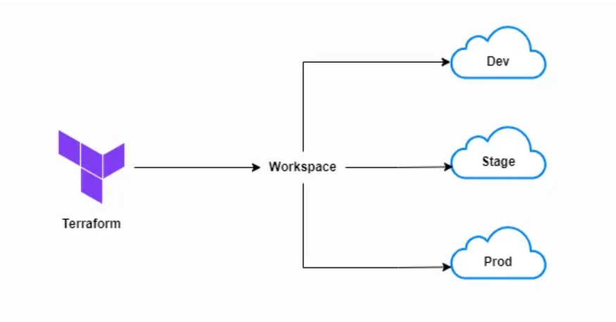
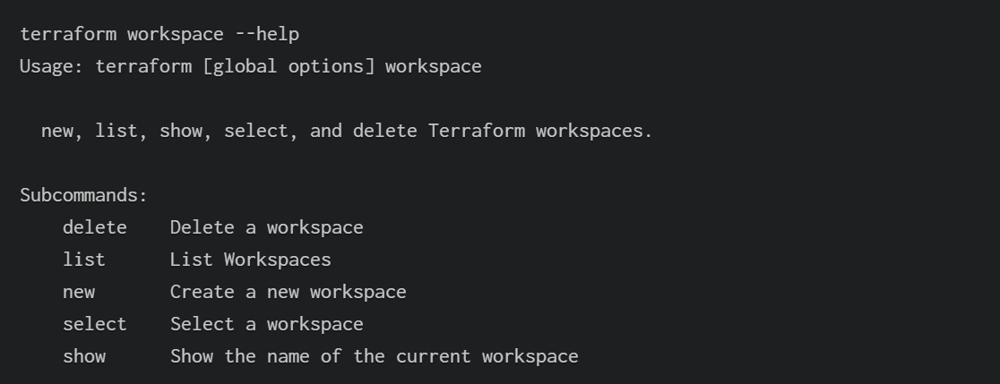
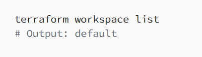
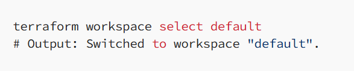
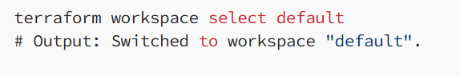
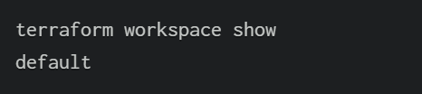
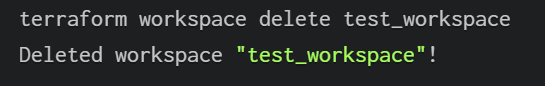
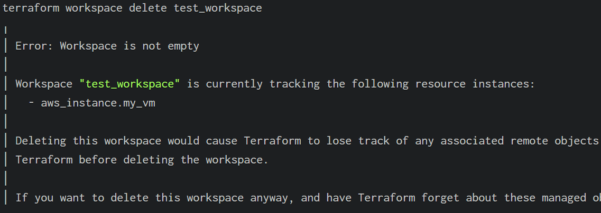
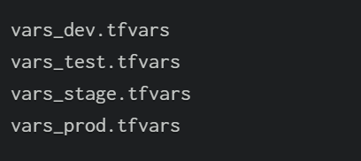
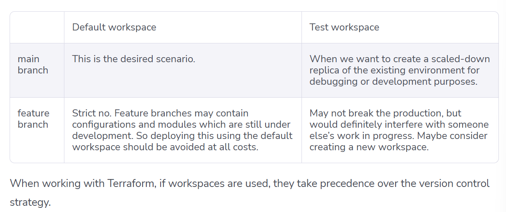

# Terraform Workspace

Terraform workspaces allow we to manage multiple environment (dev, staging, prod) using a single set of configuration files.



Each environment isolation by creating own terraform state file means that if we change something in one environment it will not affect other environment.

By default, when you run the terraform commands to `create cloud resources` using Terraform’s configuration language, they are created in the `default workspace`.

Workspaces are a handy tool for testing configurations, offering flexibility in resource allocation, regional deployments, multi-account deployments, and more.

Terraform stores information about all managed resources in a state file. It is important to store this file in a secure location. Every Terraform run is associated with a state file for validation and reference. Any modifications to the Terraform configuration, whether planned or applied, are validated against the state file first, and the result is updated back to it.

If you are not consciously using a workspace, all of this already happens in the default workspace. Workspaces help you isolate independent deployments of the same Terraform configuration while using the same state file.

### Why Use Workspaces?

- Isolation: Separate state files for each environment.
- Reusability: Use the same configuration for dev, staging, and prod.
- Simplicity: Avoid maintaining multiple copies of your code.

# Terraform Workspace vs Terraform Environments

Terraform workspaces create logical separation of state files within a single Terraform configuration. Each workspace has its own state file, allowing you to manage different environments (dev, staging, prod) using the same set of configuration files. W

Terraform Environments tyically refer to the overall infrastructure setup, including all configurations and resources that define it

# Terraform Commands for Workspace

# workspace command help

```bash
terraform workspace --help
```



# List all workspaces

```bash
terraform workspace list
```



# Create a new workspace

```bash
terraform workspace new dev
```



# Switch to the dev workspace /Switch Between Workspaces

```bash
terraform workspace select default
```



# Show current workspace / Verify the setup

```bash
terraform workspace show
```

another way to verify it would be to run the `list command`and see where the asterisk (\*) is pointing to.



# Delete a workspace

```bash
terraform workspace delete test_workspac
```



### Example of Delete workspace with -force option

if we try to delete a workspace where certain resources are being managed by Terraform, it will not let you delete that workspace, suggesting using the `-force` option instead.

```bash
terraform workspace delete -force test_workspac
```



Using the -force option may not be a good idea as we will lose track of all the resources being managed by Terraform. A better option would be to select that workspace, run the destroy command, and then attempt to delete the workspace again.

Note: The default workspace cannot be deleted.

# Using workspaces in Our configuration files

Workspaces are often used to customize resources for different environments.

Example : Deploy an EC2 instance with environment-specific configurations.

### main.tf

```bash

provider "aws" {
  region = "us-east-1"
}

resource "aws_instance" "web" {
  ami           = "ami-0c55b159cbfafe1f0" # Amazon Linux 2 AMI (us-east-1)
  instance_type = terraform.workspace == "prod" ? "t2.large" : "t2.micro"
  tags = {
    Name = "web-instance-${terraform.workspace}"
  }
}

output "instance_id" {
  value = aws_instance.web.id
}
```

`terraform.workspace`: Returns the current workspace name (e.g., "dev", "prod").
`terraform.workspace.name`: An alias for `terraform.workspace`.
`terraform.workspace.id`: Returns the unique ID of the current workspace.

### Hands -on : deploy to Multiple Environments using Workspaces

#### Step 1 : Initialize Terraform configuration

```bash
terraform init
```

#### Step 2 : Create a new workspace

```bash
terraform workspace new dev
terraform workspace new stage
terraform workspace new prod
```

#### Step 3 : Switch to the dev workspace

```bash
terraform workspace select dev
```

#### Step 4 : Deploy to the dev workspace

```bash
terraform apply
```

#### Step 5 : Deploy to Each environment

```bash
terraform workspace select stage
terraform apply
terraform workspace select prod
terraform apply
```

# manage variables with Terraform workspaces

Managing variables with Terraform workspaces is essential when we need different configurations for different environments, like dev, test, stage, and prod.

### Create a folder named envs/ to store the variable files for each environment.

```bash
my-terraform-project/
├── main.tf
├── variables.tf
└── envs/
    ├── dev.tfvars
    └── prod.tfvars
```

### variables.tf

```bash
variable "instance_type" {
  type    = string
  default = "t2.micro"
}

variable "environment" {
  type    = string
 description = "The name of the environment"
}
```

### main.tf

```bash
provider "aws" {
  region = "us-east-1"
}

resource "aws_instance" "web" {
  ami           = "ami-0c55b159cbfafe1f0" # Amazon Linux 2 AMI (us-east-1)
  instance_type = var.instance_type
  tags = {
   # terraform.workspace dynamically reads the active workspace name
    Name = "web-instance-${var.environment}"
    Environment = var.environment
  }
}

output "instance_id" {
  value = aws_instance.web.id
}
```

### Populate the .tfvars Files

Create your environment-specific files inside the envs/ folder. Ensure the values match the definitions in variables.tf.

For each environment, you can declare a tfvars file:

```bash
# envs/dev.tfvars

instance_type = "t2.micro"
environment   = "dev"

#env/prod.tfvars
instance_type = "t2.micro"
environment   = "prod"

```



### Initialize and Create Workspaces

Run the initialization command, then create separate workspaces for dev and prod.

```bash
terraform init

# create separate workspaces for dev and automatically select it
terraform workspace new dev

# Switch to the prod workspace and automatically select it
terraform workspace new prod
```

### Execute and Deploy

Whenever we switch to a workspace, we must manually supply the matching -var-file flag to ensure the correct configuration is pulled.

##### Deploying to Development:

```bash
terraform workspace select dev

# 2. Plan using the dev tfvars
terraform plan -var-file="envs/dev.tfvars"

# 3. Apply using the dev tfvars
terraform apply -var-file="envs/dev.tfvars"
```

##### Deploying to Production:

```bash
terraform workspace select prod

# 2. Plan using the prod tfvars
terraform plan -var-file="envs/prod.tfvars"

# 3. Apply using the prod tfvars
terraform apply -var-file="envs/prod.tfvars"
```

# Beat the Competition using Terraform Workspaces

1. Use Workspaces for Environments: Dev, staging, and prod are common use cases.
2. Avoid Overloading Workspaces: Don’t use them for unrelated projects.
3. Leverage terraform.workspace: Customize resources based on the workspace.
4. Combine with Variables: Use .tfvars files for environment-specific configurations.
5. Use workspaces for short-lived, parallel environments — not long-lived ones.
6. Don't use feature branches for deployments in the default workspace.
7. Always verify your active workspace before running terraform apply.
8. Keep workspace names consistent and meaningful.
9. Clean up workspaces when they’re no longer needed.

# Common Issues and Fixes

1. State File Conflicts: Use terraform refresh to sync state with real infrastructure.
2. Workspace Not Found: Double-check the workspace name with terraform workspace list.
3. Resource Drift: Use terraform plan to detect and fix drift.

# Git branches and Terraform workspaces

Git branches maintain multiple versions of the same configuration used to develop new features or Terraform modules, whereas workspaces depend entirely on the state file maintained in the remote backend by Terraform.

In general, it is not recommended to use feature branches for deployments in the default workspace. The table below summarizes the impact of various combinations. It assumes that:

1. The Terraform configuration is maintained in a Git repository
2. Workspaces are used to create replica sets for debugging or developmental purposes
3. The remote backend is configured for the Terraform workflow

| Git branches                                       | Terraform workspaces                                             |
| -------------------------------------------------- | ---------------------------------------------------------------- |
| Maintain multiple versions of the configuration    | Workspaces maintain multiple state files.                        |
| Used to develop new features or Terraform modules. | Used to deploy the same configuration to different environments. |
| Maintain the same configuration.                   | Maintain different configurations for different environments.    |



# Limitations of terraform workspaces

Terraform workspaces do not support the following:

- No system decomposition
- No credential isolation
- Manual variable management
- Shared by default
